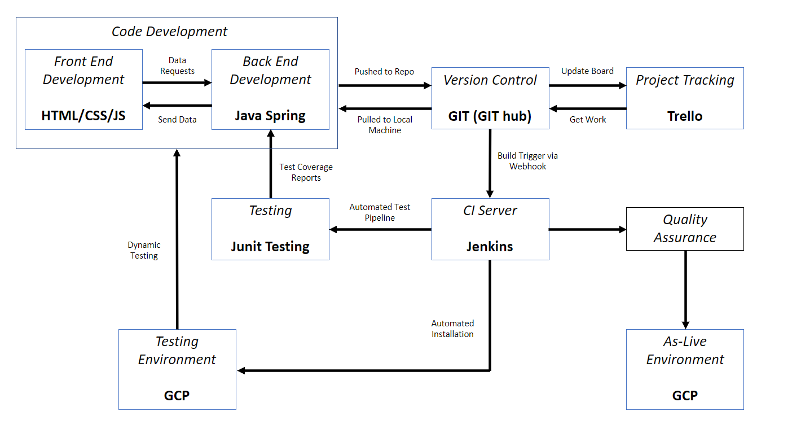

# IT Ticket Support Web Service
 
 Team 1: Alfred Joarder-White, Nickson Alemao, Atefeh Eslahi, Sam Plackett, Rajan Borkhataria, Joseph Nelson, Harriet Lloyd & Daniel Wu.

## Contents
* [Brief](#brief)
   * [Additional Requirements](#additional-requirements)
   * [Our Approach](#our-approach)
* [Architecture](#architecture)
   * [Database Structure](#database-structure)
   * [CI Pipeline](#ci-pipeline)
* [Project Tracking](#project-tracking)
* [Risk Assessment](#risk-assessment)
* [Testing](#testing)
* [Front-End Design](#front-end-design)
* [Known Issues](#known-issues)
* [Future Improvements](#future-improvements)
* [Authors](#authors)

## Brief
As a team we developed a web application based on a specification that has been provided to us, within 4 weeks. The concept is a web-hosted application that Atos employees can access to post help tickets to a publicly accessible help queue.

The application is a Spring Boot Help Queue application with full CRUD functionality for practical use as a support ticket system which will demonstrate what we have all learnt through-out our training programme. We are expected to produce a basic CI pipeline to integrate and deploy new code as it is created. 

### Additional Requirements
In addition to what has been set out in the brief, we included the following: 
* A fully functioning Help Queue web application deployed in an GCP virtual machine.
* Full documentation of the system, including project development, risk assessment, component level diagrams and installation instructions.
* A simple automated CI system, also with full documentation discussing how the tools were utilised.
* A 30 minute presentation that demonstrates:
   * our team's project management approach (team roles, sprints, product backlog, priorities, etc.)
   * the functioning application and the features that were implemented
   * the functioning CI pipeline with a fully automated rolling update   

### Our Approach
To achieve this, we produced a web-hosted ticket application that must allow Atos employees to do the following:

## Architecture
### Database Structure
This image shows our entity relationship diagram (ERD) showing the major entities within the system scope, and the inter-relationships among these entities. 

### CI Pipeline

The continuous integration (CI) pipeline shows the associated frameworks and services related to them. Automated pipelines allows for rapid and simple development-to-deployment by removing manual errors and providing standardised feedback loops to developers enabling faster product iterations.
By using a local machine and pushing code to GitHub a new code will automatically pushed to Jenkins with a build trigger via Webhook and automatically installed on the Google Cloud Platform (GCP) for dynamic testing. 

The code development is split into Front End and Back End Development to ensure an DevOps way of working with the Front End using HTML/CSS/JS and the Back End using Java and Spring. The data is sent between the front and back end development to ensure information is continuously passed between the two teams, so that the method of working is iterative. 
The design of the Jenkins pipeline job means that if a previous build stage fails, the entirety of the job will fail, providing developers detailed information about where the error has occurred.

### Project Tracking
As a group we used Trello to track the progress of the project and for an agile way of working.
You can find the link to this board here: https://trello.com/b/khec599K/agile-sprint-board 

The board was created in a way that allowed tickets to move from the Product Backlog (left) to the point of Completion (right) representing its progress. We assigned individuals to tickets and teams aligned by their skillsets and knowledge base, often using peer programming to help upskill other team members.

*	*Product Backlog*: This is populated with prioritised list of work for the development team that is derived from the specification and its requirements. The product backlog is the single authoritative source for things that our team will work on. The most valuable items are shown at the top of the backlog so the team knows what must be delivered first.

*	*Sprint Backlog*: This is populated with tasks from the product backlog identified by the scrum master to be completed within the sprint. These tickets are in the form of user stories.

*	*User Stories*: These are an informal, general explanation of a software feature written from the perspective of the end user. This ensures that every element of the web application we designed is focused on the user experience.
 ** As a [description of user], I want [functionality], So that [benefit].
 
*	*In Progress*: For any ticket that a team member has worked/spent time on this is then moved to the ‘in progress’ section of the Trello board.

*	*Quality Assurance (QA)*: Once the team member considers the ticket to be finished (to the expected specification) they move the ticket to QA. In QA the functionality of the features will be tested against the acceptance criteria.

*	*Completion*: Any ticket that has passed QA is moved into completion.

### Risk Assessment

The risk assessment for our project was located on a shared Document via OneDrive so we all had access to it.
Here is a screenshot of it:

### Testing

### Front-End Design
To begin with the design, we initially created a wireframe from the use case diagram to lay out the content for each page and understand its functionality, considering the user needs and user journey.

Following on from the Wireframe, we created a rudimentary page structure using a simple HTML structure in Visual Studio Code, this allowed us to see preliminary design and content of each page and to provide a foundation for further web application design.

